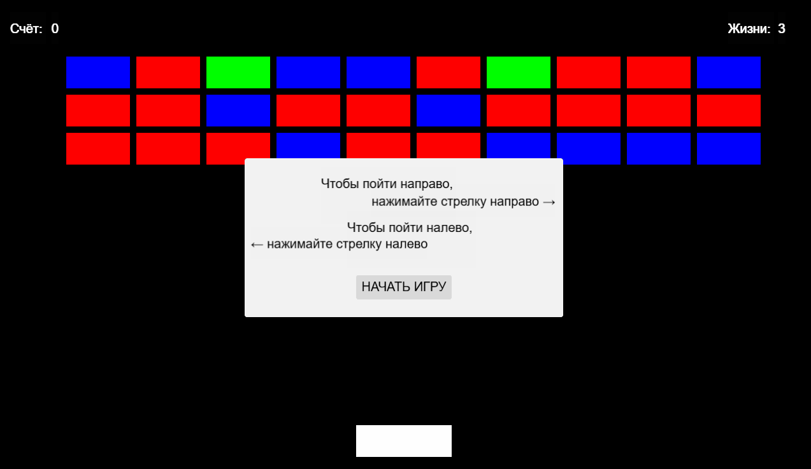

Цель игры - управляя платформой с помощью стрелочек вправо-влево на клавиатуре, разбить все кирпичи шариком.

Красные кирпичи разбиваются с 1 удара, синие с 2, а зеленые с 3.

Каждый запуск цвет кирпичей распределяется случайным образом.

За каждый удар по кирпичу даются очки.

Если у игрока меньше 3 жизней, то с некоторым шансом при разбитии кирпича может выпасть сердечко. Если его подобрать, то игроку начислится дополнительная жизнь.

Если все жизни у игрока закончатся, то игрок проигрывает.

Если игрок собьет все кирпичи, то он побеждает.

Написано с помощью cocos creator.
